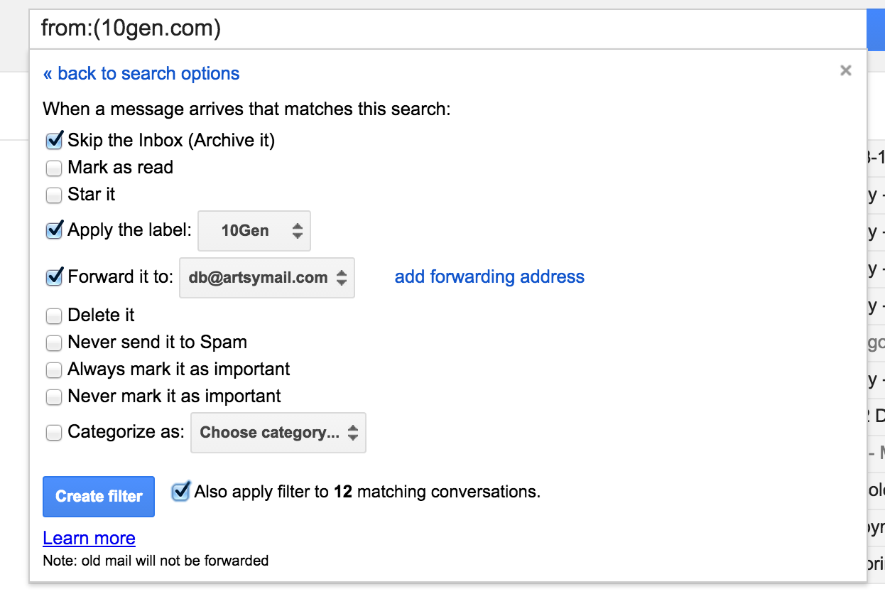

# Frequently Asked Questions

## How to set up a new shared service account

* The it@artsymail.com mailbox is used to set up many shared service accounts. To avoid missing important account notifications, _all_ such accounts should set up forwarding filters from the account's domain to an individual who can be responsible for account changes, billing errors, etc.
* E.g., for an account at 10gen.com, the filter should be **from:10gen.com**, **skip the inbox**, **apply a label**, and **forward** to a real team member's mailbox.
* It will look something like:

* When possible, unsubscribe the it@artsymail.com from non-essential notifications.
* On a regular basis, any un-handled mail that ends up in the main it@artsymail.com inbox will be reviewed and filtered or unsubscribed (currently by [Joey](https://github.com/joeyAghion)).

## How to manage the security bounty program

* Program overview is at [https://www.artsy.net/security](https://www.artsy.net/security).
* Security program reports are emailed to the [security@artsy.net](mailto:security@artsy.net) mailbox. Contact [#it-support](https://artsy.slack.com/messages/it-support) to join.
* All issues are tracked on the [Security Bounty trello board](https://trello.com/b/4G462edb/security-bounty). We use the identifier in the card URL (e.g., [99k4reKl](https://trello.com/c/99k4reKl/34-hsts-should-have-includesubdomains)) as the issue "ID" for reference purposes and in email threads.
* If a reported issue duplicates an existing or already-fixed issue, note the reporter's name and email address on the existing card (for notification in case it's addressed in the future) and reply-all (see the [already-tracked](security-bounty/ExampleResponses.md#already-tracked) example response) noting the issue ID.
* Ditto for just-released security vulnerabilities that are not yet cards but _are_ on the radar of the relevant engineering practice.
* If a new issue, create a card in the **Triage** column.
  * Title: brief vulnerability description
  * Description: content of the report, including steps to reproduce, links, and contact information of reporter. Include any attachments if relevant.
* To triage, investigate issue and determine which category/column applies (may require help from other teams):
  * **Who Cares?** - correctly reported, but deemed to not be a serious enough vulnerability to require fixing (e.g., reporting server version in headers demonstrates potential vulnerability)
  * **By Design** - inherent in product/technology choices (e.g., cookies can be copied between machines)
  * **Should Have** - worth fixing, but not urgently (e.g., stricter password policy)
  * **Must Have** - directly exploitable to expose sensitive data, etc. (e.g., password reset tokens not invalidated after use)
  * Issues determined to be invalid or irrelevant should be archived after noting the justification (see the [nonissue](security-bounty/ExampleResponses.md#nonissue) example response).
* New _Should Have_ and _Must Have_ issues should become work items for the relevant teams. Reply[-all] to the reporter thanking them and explaining that it will be eligible for a bounty when fixed (see the [eligible-for-bounty](security-bounty/ExampleResponses.md#eligible-for-bounty) example response) and noting the issue ID.
* See the [bounty-nag](security-bounty/ExampleResponses.md#bounty-nag) example response for reporters who repeatedly email to check the status of their reward.
* When an issue is fixed, move card to **Fixed**, ask reporter to confirm in order to receive payment, and request their details for receiving the bounty (see [confirm-fix-to-receive-payment](security-bounty/ExampleResponses.md#confirm-fix-to-receive-payment) example response).
* Bounties are typically $25, or can be higher for serious issues (according to your judgment). See the [bounty-complainer](security-bounty/ExampleResponses.md#bounty-complainer) example response for those who want more.
* Once fix has been confirmed and payment details received, move to **Pay**.
* Pay via Paypal, noting transaction ID in card (dB typically handles this from his personal Paypal account). Move card to **Add to /security page** once paid.
* [Edit the /security page](https://admin.artsy.net/page/security) to add a [reasonably vague] issue description and the reporter's name/link. Archive card once complete.
