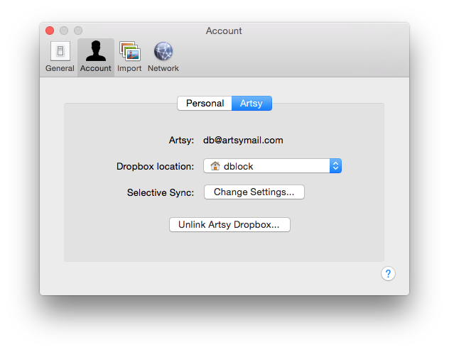
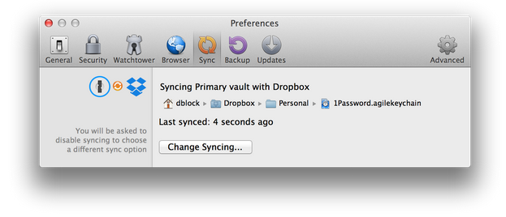
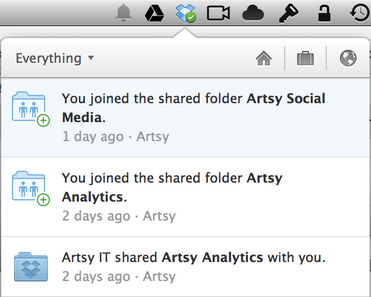
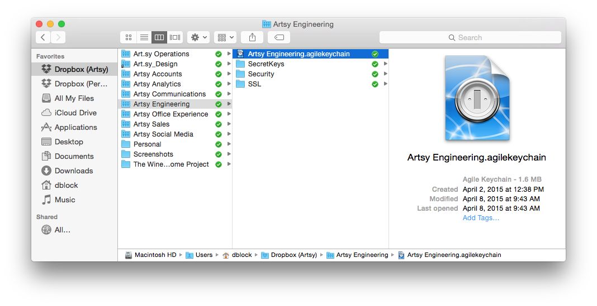
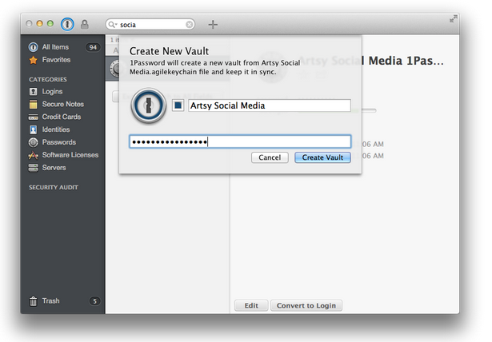
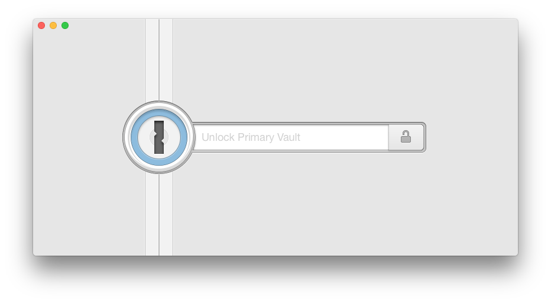
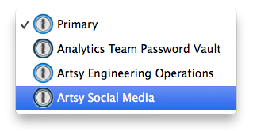

# Dropbox + 1Password

1Password is a secure platform where we can store our Artsy passwords. Passwords are stored in separate vaults accessible by different teams and team members. Vaults are shared via Dropbox.

## Configure Dropbox

Download and install Dropbox from [https://www.dropbox.com/download](https://www.dropbox.com/download) or the [AppStore](https://itunes.apple.com/us/app/dropbox/id327630330).

You should have received an invitation to your Artsy dropbox with an `@artsymail.com` email address. Configure a personal account and an Artsy account in Dropbox side-by-side. If you don’t have a personal dropbox account, create one. This will allow you to access Artsy passwords with a personal master password.

## Configure 1Password

You must use 1Password for your own passwords as well as for Artsy passwords. Artsy will buy you a 1Password license if you don’t already have one. Ops will provide you with a key.

Download and install 1Password version 4 (older versions don’t support multiple vaults) from [https://agilebits.com/downloads](https://agilebits.com/downloads) or the [AppStore](https://itunes.apple.com/us/app/1password-password-manager/id443987910).

Configure it for your personal use with a strong password that you will remember. This creates a so-called "Primary" vault. Place the vault in your personal dropbox folder via the 1Password, _Preferences_ menu under the _Sync_ tab.

## Access Artsy Password Vaults

Various Artsy teams have different password vaults with many passwords. A vault is shared with you via your Artsy Dropbox account (never share any Artsy content with a non-Artsy account). Accept these invitations.

A vault is a _.agilekeychain_ file in your Dropbox.

Double-click the file. 1Password will prompt you for a vault name and a password. Obtain this password from the ops person who has shared the vault with you (or any other engineer).

You don’t need to remember this password, next time you need to unlock your 1Password, use your personal master key.

You’re now all set. Click on the Vault icon on the top left 1Password menu to get a list of vaults.

## Security

Follow the following rules of thumb.

* When signing up for a new service, generate a new strong password.
* For all new services used by Artsy add the password to 1Password Engineering vault.
* Do not mix personal and Artsy things, we recommend creating a personal "work" vault for all your personal Artsy passwords.
