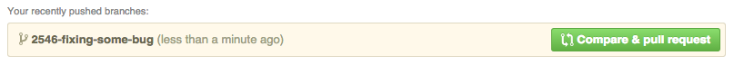
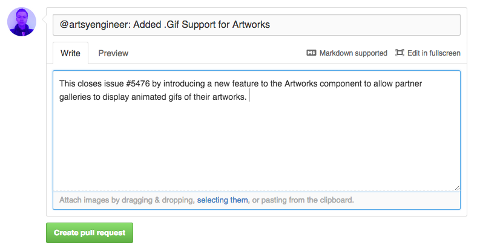
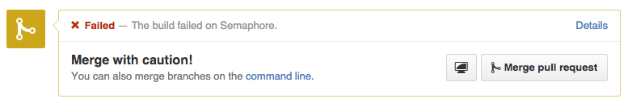
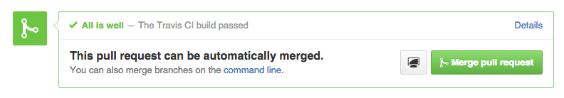

### Github and Merging

##### Integration-Manager Work flow

Our work flow for working on code and having it added to our 'main codebase' is a
variation on what is known as the '[Integration-Manager Workflow](http://git-scm.com/book/en/v2/Distributed-Git-Distributed-Workflows#Integration-Manager-Workflow),' except we use Github's web tools instead of email.

It generally would work as follows:

> 1. Create a topic branch from master.
> 2. Make some commits to improve the project.
> 3. Push this branch to your GitHub project.
> 4. Open a Pull Request on GitHub.
> 5. Discuss, and optionally continue committing.
> 6. The project owner merges or closes the Pull Request.

#### Example Workflow

A typical workflow at Artsy using Git and Github to implement a feature and submit a Pull Request to
a repository:

````
# Before starting, make sure your master is on parity with the current repository

git checkout master
git pull upstream master

# Create a branch to work on

git checkout -b 2673-Hide-Gallery-Phone-Numbers

# Do some coding, make some commits. Finally, when you're finished, checkout master
# and pull the current upstream. Rebase your master branch into your working branch
# and squash unnecessary commits and resolve possible merge conflicts.

git checkout master
git pull upstream master
git checkout 2673-Hide-Gallery-Phone-Numbers
git rebase master -i

# When you're ready to merge your branch into the repository, push your branch to
# your own fork.

git push origin 2673-Hide-Gallery-Phone-Numbers
````

Now, on Github, if you pushed the branch if you check the Github repository
you should see the option to 'Compare & Pull Request.' You can look over the status of your branch in
relation to the repository on Github ( commits, files changed and their differences related to the current
repository, etc... ).



To submit your code for review, we title the Pull Request by describing what the Pull Request is
changing in the code, and @ another engineers Github account to designate it for their review.

Try to give a brief description of the change, how it was implemented, and if it's closing any open
issues. Example:



This means that @artsyengineer will look over our code and comment on any code that will need to be changed
before the branch is appropriate for merging. As well, Github will start running the respective
repositories Continuous Integration test suites against your new code and tell you if causes any
tests on the server to fail, in which case further code revisions will also be necessary.

> '[Continuous Integration](http://en.wikipedia.org/wiki/Continuous_integration)' is the practice of integrating our new code into the production environment
several times a day in small, easily manageable events. It is done in conjunction
with automated testing that prevents any small change from breaking the production version and keeps
any sone developer's working changes from breaking another developer's code.



Finally, the request will be merged if it passes the test suite and has no further suggestions
from the engineer reviewing your code.



## Try It Out

In this repository, you'll see that there are several issues open. Pick an issue and try to use the
Artsy workflow to submit a pull request that will resolve the issue - take the chance to experiment
with some of the earlier techniques, for instance.

* Create an intentionally messy series of commits and rebase them into a cleaner history.
* Amend a commit. Create a commit with spelling errors or missing files and attempt to fix it.
* Try to roll-back a change. Commit a series of changes and try to revert some of them.
* Create and solve a [merge conflict](http://www.choskim.me/when-do-merge-conflicts-occur-in-git/).
