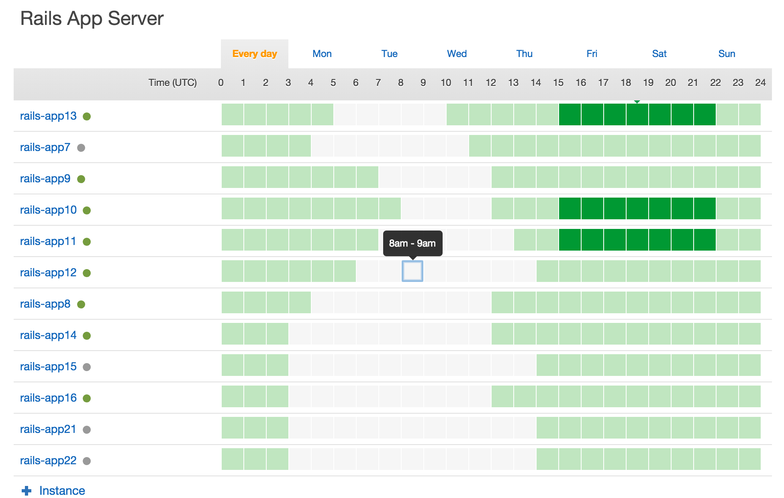

# Platform Practice FAQ

How to...

#### Suggest a feature or point out a bug
Contact any Platform team member.

#### Make a new Heroku app or service "production-ready"

(Work in progress)

1. Review [Heroku's Production Check](https://devcenter.heroku.com/articles/production-check) to ensure production-level dyno resources and database tier.
2. Have you set up SSL? We use [Heroku's SNI SSL (beta)](https://devcenter.heroku.com/articles/ssl-beta) and our wildcard SSL certificate (files available in 1Password) to securely host apps at *.artsy.net subdomains. You'll also want to set up the corresponding DNS at [DynECT](https://manage.dynect.net/).
  - Here are the relevant Heroku commands (while this is in labs):
      ```
      heroku labs:enable http-sni --app <x>  # enable the lab
      heroku plugins:install heroku-certs --app <x>  # install the _certs beta command
      # owner must upgrade dynos to Hobby/Professional
      heroku domains:add <x>.artsy.net --app <x>
      heroku _certs:add concatenated.crt artsy.key --type sni --app <x>
      ```
  - For a Rails app, `config.force_ssl = true` in an environment file is also needed, to redirect to SSL, add the HSTS header, and mark cookies as 'secure'.
2. Add the [New Relic add-on](https://elements.heroku.com/addons/newrelic).
  - Based on your application decide which product to use for the most apps we use APM
  - Select web-agent based on your platform
  - follow newrelic setup
3. Add the [Papertrail add-on](https://elements.heroku.com/addons/papertrail) and configure archiving to the [artsy-logs](https://console.aws.amazon.com/s3/home?region=us-east-1&bucket=artsy-logs) S3 bucket (which already grants access to Papertrail).
4. You may want to implement a health-check endpoint (e.g., `/health`) that returns success when basic system dependencies are available.
5. Add a Pingdom alert that checks the status of that endpoint. The "Alert Artsy (5 min)" policy is a reasonable policy to start with (it alerts in [#platform-alerts](https://artsy.slack.com/messages/platform-alerts)).
6. You wrote tests, right? Set up CI with any of our providers (Travis, Circle, or Codeship). Circle is a reliable place to start if you don't have special requirements. See this [example circle.yml](https://github.com/artsy/impulse/blob/master/circle.yml).
7. Consider automating deployment. Many projects use a provider like Circle to deploy to staging automatically upon merges to the `master` branch. Similar configuration can be used to deploy to production upon merges from the `master` branch to a `release` branch. ([example circle.yml](https://github.com/artsy/impulse/blob/master/circle.yml)).
8. Review [Monitoring.md](Monitoring.md) for other possible metrics and monitoring.

#### Get a read-only data console:
1. Are you sure you can't satisfy your need with existing reports and dashboards?
2. https://docs.google.com/a/artsymail.com/document/d/1hCTBaynWLnSxgNQEWRTU1nm27KIizQiLgO5b0jHs7hA/edit

#### Add a new AWS user
1. Navigate to IAM from the AWS dashboard
2. Users > Create new users
3. Choose user’s name (e.g., jill) > Create
4. Copy the generated access key ID and secret access key for later
5. Users > click on the new user > Add user to groups
6. Select appropriate groups (e.g., engineering, reporting) > Add to groups
7. On user’s page, Manage password > Assign auto-generated password > Apply
8. Copy new password for later
9. The new user can log in at Artsy’s dedicated sign-in page: https://artsy.signin.aws.amazon.com/console
10. Send the user their name, password, access key ID, secret access key, and the sign-in link
11. For SSH access, the user will need to upload their SSH public key to their **OpsWorks** account. You can find this by logging in to AWS, finding OpsWorks under "Services", then MySettings (or try [this link](https://console.aws.amazon.com/opsworks/home?region=us-east-1#/mysettings)).

Email template:

    For operations that require access to AWS, you'll need these:
    
    access key: _________
    secret access key: (sent separately)
    username: _________
    
    These will need to be AWS_ID, AWS_SECRET, and AWS_USER (if your local username is different) in your environment for some Gravity operations.
    
    To log into the AWS console, visit our organization sign-in page:
    
    https://artsy.signin.aws.amazon.com/console
    
    Use the username above and [temporary] password: _________
    
    For access to the Opsworks instances (e.g., for SSH or rails consoles), you will need to upload your public SSH key to Opsworks > "My Settings" here:
    
    https://console.aws.amazon.com/opsworks/home?region=us-east-1#/mysettings


#### Scale the API’s server capacity
(e.g., in advance of emails or expected traffic surges)

1. Log in to AWS with your IAM account at [Artsy’s dedicated sign-in page](https://artsy.signin.aws.amazon.com/console) (request an account if you don’t have one)
2. In the Services menu, choose OpsWorks and navigate to the `gravity-production` stack
3. Navigate to Time-based in the Instances menu. Under Rails App Server, this page displays all available time-based servers and solid green squares for hours when they’re scheduled to run.
4. Choose the day you would like to add capacity.



There are likely already some time-based servers scheduled to run during peak traffic periods (generally corresponding to the business day). Click the corresponding squares (changing them from inactive/gray to active/green) to add capacity during selected hours.

Note that hours are displayed in UTC, so be sure to convert as needed.
If you are trying to start servers immediately, note that server start-up can take 15-20 minutes (after which they’ll begin accepting requests).

#### Access the redshift data warehouse

See the [Redshift doc in Fulcrum](https://github.com/artsy/fulcrum/blob/master/doc/redshift.md).

#### Restart Jenkins
* Sometimes the jenkins server (http://joe.artsy.net:9000) goes down.
* Try SSH-ing: `ssh joe@joe.artsy.net` (password is in Engineering 1Password vault)
* Restart the jenkins service:
```
sudo su
/etc/init.d/jenkins status  # Jenkins Continuous Integration Server is not running
/etc/init.d/jenkins start  # =>  * Starting Jenkins Continuous Integration Server jenkins
```

#### Remove or alter an auction result

Auction results are imported from [MutualArt](http://www.mutualart.com/) and automatically matched to artists in our database. Occasionally a result is incorrect (e.g., never offered for sale, or matched to an incorrect artist), or must be removed as per legal demands from the artist or gallery.

**If a result has been incorrectly matched to a similarly named artist,** a simple fix is to _add_ the missing artist to our database. The next time the [AuctionArtists Heat build](https://github.com/artsy/heat/blob/master/app/models/resque/batch/auction_artists/batch.rb) runs, it will associate the auction result with the new artist.

**If a result must be removed altogether,** use a Gravity console to deactivate it, providing a reason:

    AuctionLot.find('<id>').deactivate!('Requested by Adam citing questionable authenticity')
