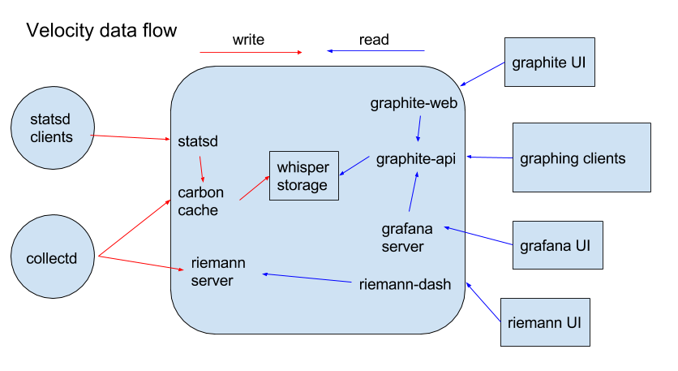

# Monitoring

---

## Monitoring concerns and solutions

## High-level team KPIs

http://artsy-dashing.herokuapp.com/platform

* Uses Shopify's [dashing](https://github.com/Shopify/dashing)
* Bidding: [http://artsy-dashing.herokuapp.com/bidding](http://artsy-dashing.herokuapp.com/bidding
)

Repo: [https://github.com/artsy/artsy-dashing](https://github.com/artsy/artsy-dashing)

---

## General time-series data

http://velocity.artsy.net

* Counts, timers, etc.
* Uses [Graphite](http://graphite.wikidot.com/) and [statsd](https://github.com/etsy/statsd)
* See:
  * Graphite dashboard
  * JSON
  * Saved charts

Repo: [https://github.com/artsy/velocity](https://github.com/artsy/velocity)

### [Collectd](http://collectd.org/)

Collectd is a systems metrics collection daemon we install to push system load / memory / disk space and other metrics to graphite.  Installed via the [artsy_monitoring cookbook](https://github.com/artsy/infrastructure/tree/master/site-cookbooks/artsy_monitoring)

---

## Real-time dashboards

http://artsy-tasseo.herokuapp.com

* Uses [tasseo](https://github.com/obfuscurity/tasseo) library
* Based on graphite/statsd data
* Overall health: [http://artsy-tasseo.herokuapp.com/velocity](http://artsy-tasseo.herokuapp.com/velocity)
* Bidding: [http://artsy-tasseo.herokuapp.com/bidding](http://artsy-tasseo.herokuapp.com/bidding)
* Gemini (image-processing): [http://artsy-tasseo.herokuapp.com/gemini](http://artsy-tasseo.herokuapp.com/gemini)

Repo: [https://github.com/artsy/artsy-tasseo](https://github.com/artsy/artsy-tasseo)

---

## [Grafana](http://docs.grafana.org/guides/gettingstarted/)

Flexible UI for retrieving metrics from carbon-api (part of graphite) and building realtime dashboards

[http://metrics.artsy.net](http://metrics.artsy.net)

[Artsy dashboard](http://metrics.artsy.net/dashboard/db/artsy) - Systems-wide throughput and event metrics for various Artsy systems
[Velocity dashboard](http://metrics.artsy.net/dashboard/db/velocity) - Collectd system metrics for the velocity.artsy.net server

---

## EXPERIMENTAL! [Riemann](http://riemann.io/)

Riemann is a metrics collection service that is built around stream-processing and alerting.

With Riemann it is possible to consume data streams, then act on changes in those streams as events, for example triggering an alert might send an email or post to a Slack channel.

Metrics must be sent over the Riemann protocol - [clients](http://riemann.io/clients.html) exist for a number of configurations.

Notably:
  - https://github.com/riemann/riemann-tools (Systems metrics)
  - https://github.com/riemann/riemann-ruby-client (Ruby client)
  - https://github.com/digital-science/riemann-metrics (ActiveSupport client)
  - https://github.com/koudelka/elixir-riemann (Elixir client)
  - https://github.com/gsandie/chef_riemann_reporting (Chef notifications client)
  - https://github.com/simao/riepete (Statsd repeater)

---

## New Relic (request- or host-level metrics)

* [gravity-production](https://rpm.newrelic.com/accounts/334984/applications/1919032) (rails app servers)
* [gravity-production (workers)](https://rpm.newrelic.com/accounts/334984/applications/10113497)
* [force-production](https://addons-sso.heroku.com/apps/force-production/addons/315ec54e-9bd5-4c2a-a1cd-96f29696d660)

---

## [AWS Opsworks](https://console.aws.amazon.com/opsworks/home?region=us-east-1) Monitoring (CPU, memory, etc.)

E.g., [gravity-production stack](https://console.aws.amazon.com/opsworks/home?region=us-east-1#/stack/64e2d852-99d2-4235-bd1f-46e7e6fa4e94/monitoring)

---

## AWS Elastic Load Balancer Metrics (health, latency)

[AWS Elastic Load Balancer](https://console.aws.amazon.com/ec2/v2/home?region=us-east-1#LoadBalancers:)

---

## Heroku monitoring (errors, memory, throughput)

E.g., [force-production](https://dashboard.heroku.com/apps/force-production/metrics/web)

---

## Pingdom (uptime)

* Dashboard: [https://my.pingdom.com/dashboard/checks](https://my.pingdom.com/dashboard/checks)
* Status page: [http://status.artsy.net](http://status.artsy.net)

---

## Logs

[Papertrail](https://papertrailapp.com/) for current/recent API logs

* Can filter (e.g., `worker1`)
* 3 days of logs retained
* Older logs archived to [artsy-logs S3 bucket](https://console.aws.amazon.com/s3/home?region=us-east-1&bucket=artsy-logs&prefix=)

Tailing via [momentum](https://github.com/artsy/momentum):

`rake ow:logs[production,worker1,/srv/www/gravity/shared/log/*.log]`

---

## Other AWS logs and metrics:

### AWS Cloudwatch

[https://console.aws.amazon.com/cloudwatch/home?region=us-east-1](https://console.aws.amazon.com/cloudwatch/home?region=us-east-1)
s
### AWS Cloudtrail

[https://console.aws.amazon.com/cloudtrail/home?region=us-east-1#/events](https://console.aws.amazon.com/cloudtrail/home?region=us-east-1#/events)

---

## Alerting

Platform configures all alerts sent to the `platform-alerts@artsymail.com` email address.  This is configured to notify the Platform team about a failure and in addition, push a message to the `platform-alerts` Slack channel.  Other teams should set up similar notification workflows.

### Best practices

Configure a health check in your application.  Create an endpoint that responds to `GET /health` that runs small tests on, at the very least, the application itself, as well as dependent systems in the application.  For example, you could test that the application's Redis connection is healthy by setting then getting an arbitrary key.

Configure this endpoint to return a status code 200 / 500 along with any diagnostic JSON.

Then, configure Pingdom to monitor this endpoint, posting alerts to `platform-alerts@artsymail.com`

---

## Database metrics

[Compose.io](https://app.compose.io/artsy/deployments)

[MongoDB Cloud Manager](https://cloud.mongodb.com)

---

## Honorable mention

Data changes: https://github.com/artsy/gravity/blob/master/doc/TrackingDataChanges.md

## Deprecated

* Snowplow (real-time events pipeline): http://artsy-tasseo.herokuapp.com/snowplow
