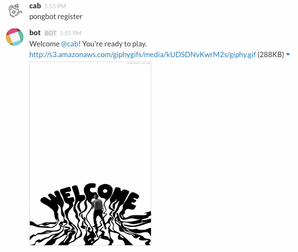

# Slack

Get on [Slack](https://artsy.slack.com). You can download the OSX app from the [Apple store](https://itunes.apple.com/us/app/slack/id803453959?mt=12). Also install it on your phone. We use Slack for all internal messaging, and prefer it to email in, basically, all cases.

### Engineering Slack Channels

* [#dev](https://artsy.slack.com/messages/dev): For asking questions to all engineers, or discussing things related to the dev team as a whole.
* [#dev-offtopic](https://artsy.slack.com/messages/dev-offtopic): Random things you want to send to the dev team that are not specifically work-related.
* [#help](https://artsy.slack.com/messages/help): For asking and answering questions.

### Tips and Tricks

* Typing `@channel` in any channel will send a notification to everyone in that channel. Refrain from doing this unless it’s imperative that everyone see your message. You can also `@` people directly in a channel, or direct-message them.
* `/hangout` starts a google hangout in that channel
* Slack uses markdown for styling text.
    - \`\`\````multi-line code```\`\`\`
    - \``single-line code`\`
    - \**italic*\*
    - \*\***bold**\*\*
* Read this short article on [getting the most out of Slack](https://medium.com/@slackhq/11-useful-tips-for-getting-the-most-of-slack-5dfb3d1af77).

### Pongbot

Join [#pong](https://artsy.slack.com/messages/pong) to play ping-pong. This uses [slack-gamebot](https://github.com/dblock/slack-gamebot), which is written in Ruby and could use some new features and fixes from you. Run `pongbot register`.



Challenge someone with `pongbot challenge` to a game!


